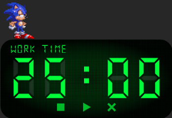
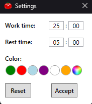

# PomodoroWPF

**PomodoroWPF** — это удобное настольное приложение для управления временем по методу Pomodoro, созданное с использованием WPF. Оно поддерживает различные темы, сворачивание в системный трей и простое управление через удобный интерфейс.

---

## 📖 Оглавление

- [Описание](#описание)
- [Особенности](#особенности)
- [Скриншоты](#скриншоты)
- [Установка](#установка)
- [Использование](#использование)
- [Планы по доработке](#планы-по-доработке)
- [Лицензия](#лицензия)

---

## 📝 Описание

**PomodoroWPF** предназначен для повышения продуктивности. Приложение помогает сосредоточиться на задачах, чередуя интервалы работы и отдыха. Интерфейс прост, интуитивен и включает:

- Темы для персонализации.
- Удобное управление через кнопки или контекстное меню в системном трее.
- Сворачивание в трей для минимизации отвлечений.

---

## ✨ Особенности

- **Метод Pomodoro**:
  - Интервалы работы и отдыха с автоматическим переключением.
  - Настройка длительности интервалов.
- **Поддержка тем**:
  - Шесть встроенных тем: Зелёная, Красная, Синяя, Фиолетовая, Оранжевая, Белая.
  - Лёгкая смена темы через меню настроек.
- **Управление через трей**:
  - Приложение сворачивается в системный трей при нажатии на крестик.
  - Контекстное меню в трее:
    - Открыть главное окно.
    - Открыть окно настроек.
    - Закрыть приложение.
- **Простой интерфейс**:
  - Удобные кнопки для управления таймером: Старт/Пауза, Сброс.
  - Скалируемые иконки.

---

## 🖼 Скриншоты

### Главное окно

### Окно настроек

---

## 🚀 Установка

### Требования:
- **Windows**: 10 или выше.
- **.NET Core Runtime**: 6.0 или выше (устанавливается автоматически через инсталлятор, если требуется).

### Шаги установки:
1. Скачайте последнюю версию установочного файла из раздела [Releases](https://github.com/username/PomodoroWPF/releases).
2. Запустите установочный файл.
3. Следуйте инструкциям установщика. Приложение создаст ярлык на рабочем столе.

---

## 🖥 Использование

1. **Запуск приложения**:
   - Дважды щёлкните на ярлык на рабочем столе.
2. **Управление таймером**:
   - **Старт/Пауза**: Используйте соответствующую кнопку для запуска или приостановки таймера.
   - **Сброс**: Сбросьте таймер, чтобы начать заново.
3. **Сворачивание в трей**:
   - Нажмите на крестик в правом верхнем углу главного окна — приложение свернётся в трей.
   - Для возврата щёлкните по значку приложения в трее или выберите пункт "Открыть".
4. **Контекстное меню трея**:
   - Щёлкните правой кнопкой мыши по значку приложения в трее.
   - Доступные действия:
     - **Открыть**: Восстановить главное окно.
     - **Настройки**: Открыть окно настроек.
     - **Выход**: Закрыть приложение.

---

## 🛠 Планы по доработке

- [ ] Добавить звуковые уведомления по завершению интервалов.
- [ ] Реализовать кастомизацию последовательности интервалов (например, Работа → Отдых → Длинный отдых).
- [ ] Интеграция с календарём для отслеживания выполненных циклов.
- [ ] Поддержка горячих клавиш для управления из любого окна.
- [ ] Поддержка нескольких языков.

---

## 📄 Лицензия

Проект распространяется под лицензией **MIT License**. Полный текст лицензии доступен в файле [LICENSE](./LICENSE).